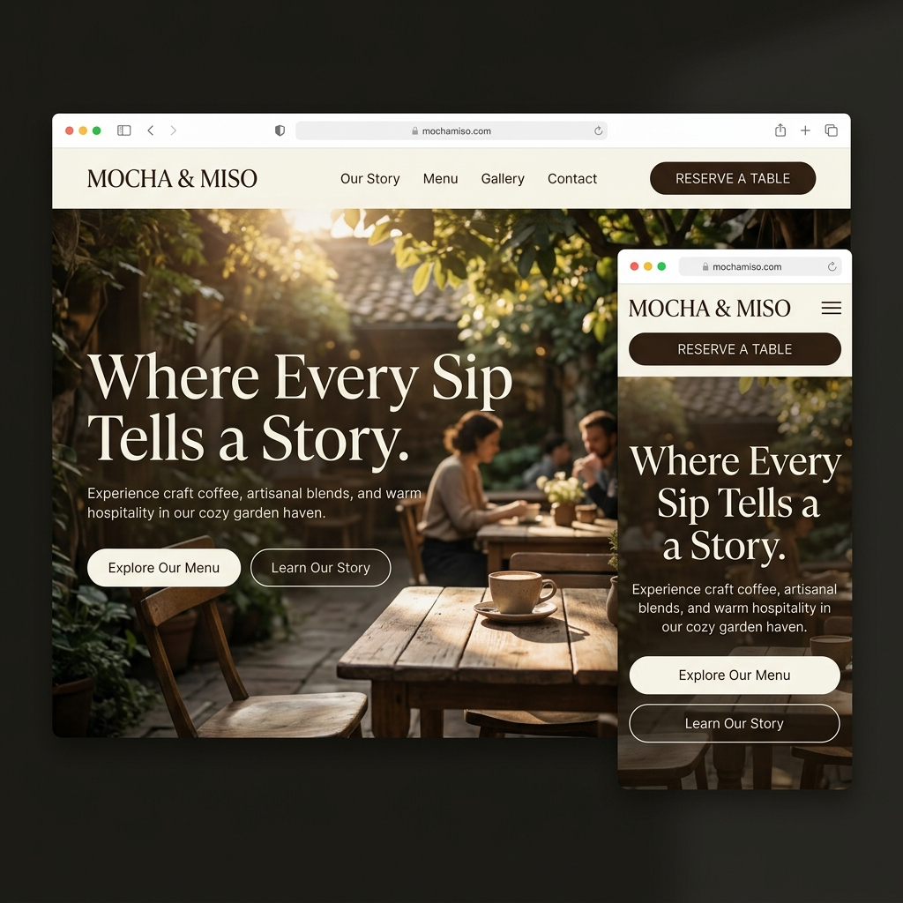
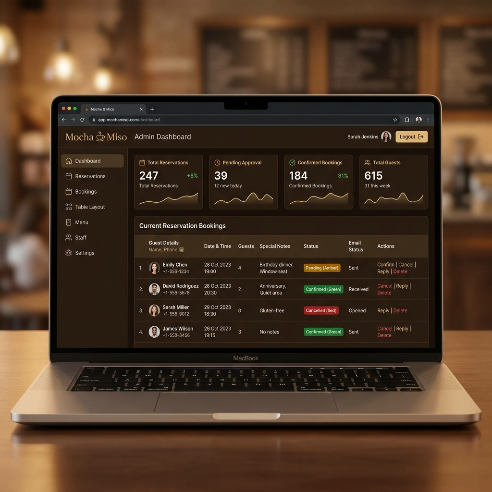

# ☕ Mocha & Miso — Craft Café Website

<div align="center">


**A premium Japandi-inspired café management system with a public-facing website and a secure admin portal.**

[](https://mochaandmiso.web.app)
[](https://mochaandmiso.web.app/admin.html)
[](https://firebase.google.com)

</div>

---

## 🖼️ Screenshots

### 🏠 Homepage — Hero Section


### 🛡️ Admin Dashboard


---

## ✨ Features

### 🌐 Public Website
- **Animated Hero Section** — Parallax background, GSAP scroll animations, steam SVG effect
- **Our Story** — Brand narrative with scroll-reveal text animations
- **Interactive Menu** — Filterable by category (Drinks, Food, Desserts) with 14+ items
- **Signature Drinks** — Full-screen showcase of specialty beverages
- **Photo Gallery** — Masonry-style café gallery
- **Table Reservation Form** — Real-time Firestore booking with email confirmation
- **Contact & Location** — Hours, address, and inquiry form
- **Custom Cursor** — Magnetic cursor with hover effects
- **Smooth Scroll** — Powered by Lenis smooth scroll library
- **Fully Responsive** — Mobile-first, hamburger menu on small screens

### 🔐 Admin Portal
- **Firebase Authentication** — Secure email/password login
- **Live Reservations Dashboard** — Real-time Firestore listener
- **KPI Stats** — Total reservations, pending, confirmed, guest count
- **Reservation Management** — Confirm, cancel, or delete bookings
- **Search & Filter** — Filter by status or search by guest name/email/phone
- **Guest Email Reply** — Send emails directly to guests via EmailJS
- **Toast Notifications** — Live feedback on all admin actions

---

## 🛠️ Tech Stack

| Layer | Technology |
|---|---|
| **Frontend** | HTML5, Vanilla CSS, Vanilla JavaScript |
| **Animations** | GSAP 3, ScrollTrigger, SplitType, Lenis |
| **Database** | Firebase Firestore |
| **Authentication** | Firebase Auth (Email/Password) |
| **Hosting** | Firebase Hosting |
| **Email** | EmailJS |
| **Backend Functions** | Firebase Cloud Functions (Node.js 20) |

---

## 🚀 Live Demo

🌐 **Website:** [https://mochaandmiso.web.app](https://mochaandmiso.web.app)

🔐 **Admin Portal:** [https://mochaandmiso.web.app/admin.html](https://mochaandmiso.web.app/admin.html)
> Admin access requires a registered Firebase Authentication account.

---

## 📁 Project Structure

```
cafe-management-system/
├── index.html              # Main public website
├── admin.html              # Admin portal
├── admin.js                # Admin dashboard logic & Firebase Auth
├── main.js                 # Public site interactions & reservation form
├── style.css               # All styles (shared across pages)
├── firebase.js             # Firebase initialization
├── firestore.rules         # Firestore security rules
├── firebase.json           # Firebase Hosting & Functions config
├── asstes/                 # Images and media assets
├── screenshots/            # README screenshots
└── functions/              # Firebase Cloud Functions
    ├── index.js
    ├── services/
    │   └── smsService.js
    └── templates/
        └── emailTemplates.js
```

---

## 🔒 Security

- **Firestore Rules** — Only authenticated users can read/update/delete reservations
- **Public Create** — Anyone can submit a reservation (with field validation)
- **Firebase Auth** — Admin dashboard locked behind Firebase email/password login
- **Environment Variables** — Sensitive API keys stored in `functions/.env` (not committed to Git)

---

## 🎨 Design System

- **Typography:** Cormorant Garamond (serif headings) + DM Sans (body)
- **Color Palette:** Warm coffee browns, cream whites, deep bark tones
- **Style:** Japandi — Japanese minimalism meets Scandinavian warmth
- **Animations:** GSAP scroll-triggered reveals, magnetic hover effects, parallax

---

## 📦 Getting Started (Local Development)

> ⚠️ The site uses Firebase Hosting auto-configuration, so some features work best when served via Firebase.

### Prerequisites
- [Node.js](https://nodejs.org/) v18+
- [Firebase CLI](https://firebase.google.com/docs/cli): `npm install -g firebase-tools`

### Run Locally
```bash
# Clone the repo
git clone https://github.com/Jishnu09-siuu/cafe-management-system.git
cd cafe-management-system

# Login to Firebase
firebase login

# Serve locally
firebase serve --only hosting
```

Open [http://localhost:5000](http://localhost:5000) in your browser.

### Deploy to Firebase
```bash
firebase deploy --only hosting
```

---

## 📄 License

This project is for personal/portfolio use. All café photos are from royalty-free sources.

---

<div align="center">

Made with ☕ by **Jishnu**

[](https://github.com/Jishnu09-siuu)

</div>
