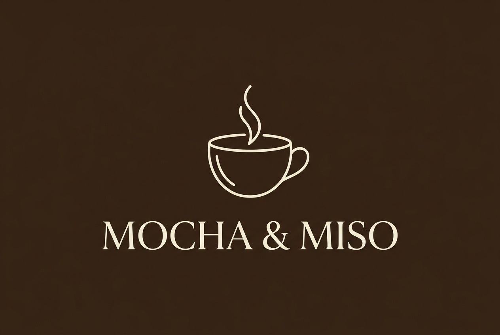
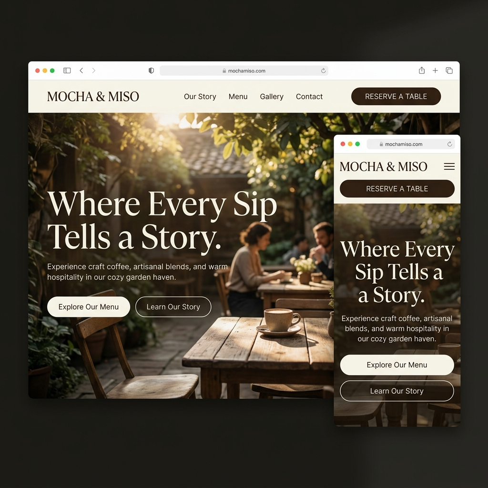
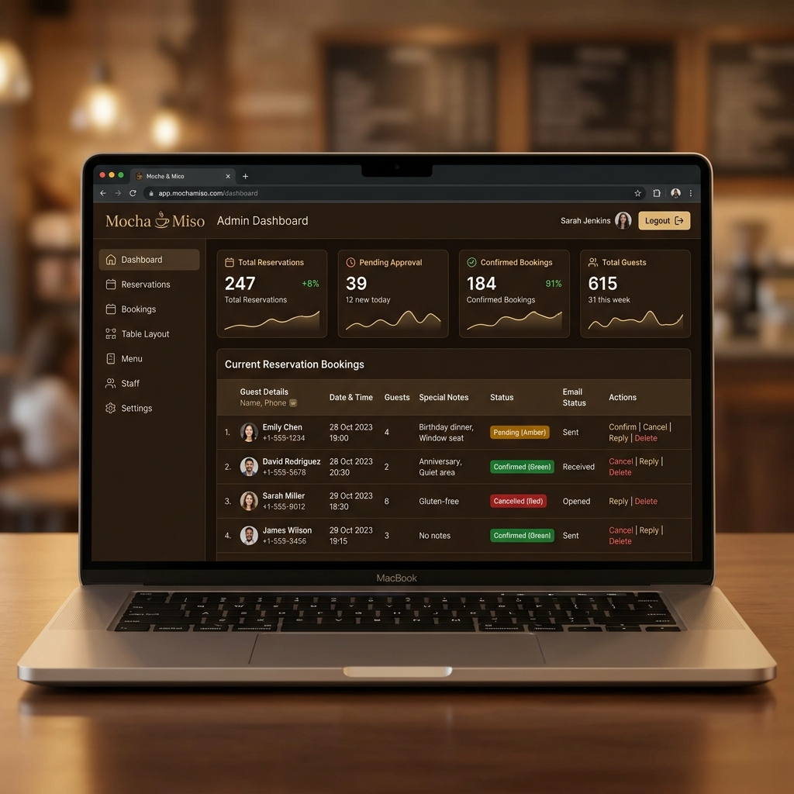

# ☕ Mocha & Miso — Website quán cà phê thủ công

<div align="center">



**Hệ thống quản lý quán cà phê lấy cảm hứng Japandi, gồm website dành cho khách và cổng quản trị bảo mật.**

[](https://mochaandmiso.web.app)
[](https://mochaandmiso.web.app/admin.html)
[](https://firebase.google.com)

</div>

---

## 🖼️ Ảnh chụp màn hình

### 🏠 Trang chủ — Phần giới thiệu


### 🛡️ Bảng điều khiển quản trị


---

## ✨ Tính năng

### 🌐 Website dành cho khách
- **Phần giới thiệu chuyển động** — Ảnh nền thị sai, hiệu ứng cuộn GSAP và hiệu ứng hơi nước
- **Câu chuyện quán** — Giới thiệu thương hiệu với hiệu ứng hiện chữ khi cuộn
- **Thực đơn tương tác** — Lọc theo nhóm đồ uống, món ăn và món tráng miệng; hơn 14 món
- **Món đặc sắc** — Giới thiệu các món và đồ uống nổi bật
- **Thư viện ảnh** — Bộ sưu tập hình ảnh quán cà phê dạng khảm
- **Biểu mẫu đặt bàn** — Lưu đặt chỗ theo thời gian thực trên Firestore và gửi email xác nhận
- **Liên hệ và địa điểm** — Giờ mở cửa, địa chỉ và biểu mẫu liên hệ
- **Con trỏ tùy chỉnh** — Hiệu ứng con trỏ hút theo nút khi rê chuột
- **Cuộn mượt** — Sử dụng thư viện Lenis
- **Tương thích mọi màn hình** — Thiết kế ưu tiên điện thoại, có menu thu gọn

### 🔐 Cổng quản trị
- **Xác thực Firebase** — Đăng nhập an toàn bằng email và mật khẩu
- **Bảng đặt bàn trực tiếp** — Cập nhật theo thời gian thực từ Firestore
- **Thống kê tổng quan** — Tổng lượt đặt, lượt đang chờ, lượt đã xác nhận và số khách
- **Quản lý đặt bàn** — Xác nhận, hủy hoặc xóa lượt đặt
- **Tìm kiếm và lọc** — Lọc theo trạng thái hoặc tìm theo tên, email, số điện thoại
- **Trả lời khách qua email** — Gửi email trực tiếp bằng EmailJS
- **Thông báo tức thời** — Phản hồi trực tiếp cho mọi thao tác quản trị

### 🍽️ Gọi món bằng QR theo bàn
- **QR riêng từng bàn** — Mỗi mã mở `order.html?table=01`, `02`...
- **Giỏ món trên điện thoại** — Khách chọn món, số lượng và ghi chú không cần đăng nhập
- **Đơn hàng thời gian thực** — Đơn mới hiện trong admin kèm số bàn, món và tổng tiền
- **Luồng phục vụ** — Mới → Đang làm → Đã phục vụ → Hoàn tất
- **Ghi nhận thanh toán** — Nhân viên bấm “Đã thanh toán” sau khi thu tiền tại bàn/quầy

---

## 🛠️ Công nghệ sử dụng

| Layer | Technology |
|---|---|
| **Giao diện** | HTML5, CSS thuần, JavaScript thuần |
| **Hiệu ứng** | GSAP 3, ScrollTrigger, SplitType, Lenis |
| **Cơ sở dữ liệu** | Firebase Firestore |
| **Xác thực** | Firebase Auth (email/mật khẩu) |
| **Lưu trữ website** | Firebase Hosting |
| **Email** | EmailJS |
| **Hàm máy chủ** | Firebase Cloud Functions (Node.js 20) |

---

## 🚀 Bản chạy trực tuyến

🌐 **Website:** [https://mochaandmiso.web.app](https://mochaandmiso.web.app)

🔐 **Cổng quản trị:** [https://mochaandmiso.web.app/admin.html](https://mochaandmiso.web.app/admin.html)
> Cần tài khoản Firebase Authentication đã đăng ký để truy cập trang quản trị.

## 🍽️ Vận hành gọi món bằng QR

1. Mở `qr.html` trên domain đã deploy, chọn số lượng bàn rồi bấm **Tạo mã QR**.
2. In và đặt từng mã lên đúng bàn. Không dùng URL `localhost` khi in QR cho quán thật.
3. Khách quét mã, chọn món và gửi đơn. Đường dẫn sẽ tự gắn số bàn.
4. Nhân viên mở cổng admin, xử lý đơn theo thứ tự **Bắt đầu làm** → **Đã mang ra**.
5. Sau khi thu tiền, bấm **Đã thanh toán** để hoàn tất đơn.

Phiên bản hiện tại ghi nhận thanh toán thủ công tại quầy hoặc tại bàn. Muốn thu tiền trực tuyến cần tích hợp thêm một cổng thanh toán phù hợp với quốc gia và tài khoản ngân hàng của quán.

---

## 📁 Cấu trúc dự án

```
cafe-management-system/
├── index.html              # Website dành cho khách
├── admin.html              # Cổng quản trị
├── admin.js                # Bảng quản trị và xác thực Firebase
├── main.js                 # Tương tác website và biểu mẫu đặt bàn
├── style.css               # Giao diện dùng chung cho các trang
├── firebase.js             # Khởi tạo Firebase
├── firestore.rules         # Quy tắc bảo mật Firestore
├── firebase.json           # Cấu hình Firebase Hosting và Functions
├── asstes/                 # Hình ảnh và tài nguyên
├── screenshots/            # Ảnh chụp màn hình trong README
└── functions/              # Firebase Cloud Functions
    ├── index.js
    ├── services/
    │   └── smsService.js
    └── templates/
        └── emailTemplates.js
```

---

## 🔒 Bảo mật

- **Quy tắc Firestore** — Chỉ người dùng đã xác thực mới có thể đọc, cập nhật hoặc xóa lượt đặt bàn
- **Tạo yêu cầu công khai** — Bất kỳ ai cũng có thể gửi yêu cầu đặt bàn sau khi các trường được kiểm tra
- **Firebase Auth** — Bảng quản trị yêu cầu đăng nhập bằng email và mật khẩu Firebase
- **Biến môi trường** — Khóa API nhạy cảm được lưu trong `functions/.env` và không đưa lên Git

---

## 🎨 Hệ thống thiết kế

- **Kiểu chữ:** Cormorant Garamond (tiêu đề có chân) và DM Sans (nội dung)
- **Bảng màu:** Nâu cà phê ấm, trắng kem và tông gỗ trầm
- **Phong cách:** Japandi — tối giản Nhật Bản kết hợp nét ấm áp Bắc Âu
- **Hiệu ứng:** Hiện nội dung theo vị trí cuộn, hiệu ứng rê chuột và thị sai bằng GSAP

---

## 📦 Bắt đầu chạy dự án trên máy

> ⚠️ Website sử dụng cấu hình Firebase Hosting; một số tính năng hoạt động tốt nhất khi chạy qua Firebase.

### Yêu cầu
- [Node.js](https://nodejs.org/) v18+
- [Firebase CLI](https://firebase.google.com/docs/cli): `npm install -g firebase-tools`

### Chạy trên máy
```bash
# Tải mã nguồn dự án
git clone https://github.com/Jishnu09-siuu/cafe-management-system.git
cd cafe-management-system

# Đăng nhập Firebase
firebase login

# Chạy website trên máy
firebase serve --only hosting
```

Mở [http://localhost:5000](http://localhost:5000) trong trình duyệt.

### Triển khai lên Firebase
```bash
firebase deploy --only hosting
```

---

## 📄 Giấy phép

Dự án dành cho mục đích cá nhân và hồ sơ năng lực. Hình ảnh quán cà phê được lấy từ các nguồn miễn phí bản quyền.

---

<div align="center">

Made with ☕ by **Jishnu**

[](https://github.com/Jishnu09-siuu)

</div>
